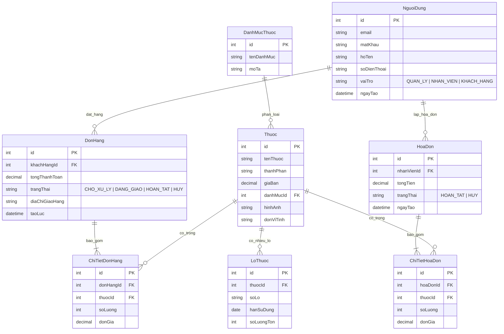
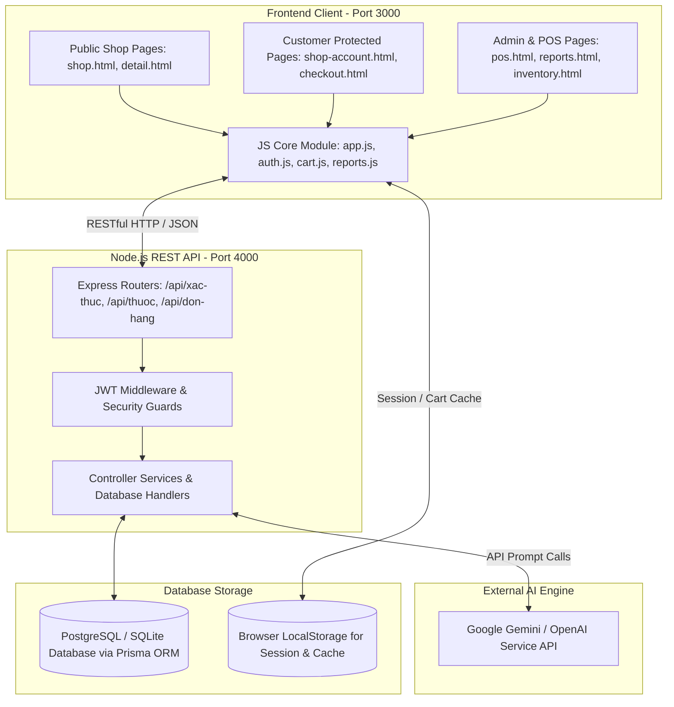

# 🏥 HỆ THỐNG QUẢN LÝ VÀ BÁN THUỐC TRỰC TUYẾN AINA PHARMACY
> **Tài liệu Báo cáo Tiến trình - Bài kiểm tra thường xuyên 1**  
> **Môn học:** Phân tích & Thiết kế Hệ thống Thông tin / Phát triển Ứng dụng Web  
> **Đề tài:** Xây dựng Hệ thống Quản lý Nhà thuốc & Cửa hàng Thuốc Trực tuyến tích hợp AI Assistant (AINA Pharmacy)

---

## 📑 MỤC LỤC BÁO CÁO

1. [Phân tích Bài toán Quản lý Nhà thuốc](#1-phân-tích-bài-toán-quản-lý-nhà-thuốc)
2. [Xác định Yêu cầu Chức năng (Functional Requirements)](#2-xác-định-yêu-cầu-chức-năng)
3. [Xác định Yêu cầu Phi chức năng (Non-Functional Requirements)](#3-xác-định-yêu-cầu-phi-chức-năng)
4. [Thiết kế Actor và Sơ đồ Use Case](#4-thiết-kế-actor-và-sơ-đồ-use-case)
5. [Thiết kế Cơ sở Dữ liệu (Database Design & ERD)](#5-thiết-kế-cơ-sở-dữ-liệu)
6. [Thiết kế Kiến trúc Hệ thống (System Architecture)](#6-thiết-kế-kiến-trúc-hệ-thống)
7. [Xác định Vị trí Ứng dụng Trí tuệ Nhân tạo (AI Integration)](#7-xác-định-vị-trí-ứng-dụng-trí-tuệ-nhân-tạo)
8. [Thiết kế Prompt và Luồng gọi AI Sơ bộ](#8-thiết-kế-prompt-và-luồng-gọi-ai-sơ-bộ)
9. [Minh chứng Sử dụng AI trong Phân tích & Thiết kế](#9-minh-chứng-sử-dụng-ai-trong-phân-tích--thiết-kế)
10. [Tài liệu Phân tích Thiết kế & Kế hoạch Triển khai](#10-tài-liệu-phân-tích-thiết-kế--kế-hoạch-triển-khai)

---

## 1. PHÂN TÍCH BÀI TOÁN QUẢN LÝ NHÀ THUỐC

### 1.1. Bối cảnh thực tế & Tính cấp thiết
Trong ngành Dược phẩm hiện đại, các nhà thuốc truyền thống đang gặp nhiều thách thức lớn:
- **Quản lý thủ công kém hiệu quả:** Theo dõi hạn sử dụng, lô sản xuất, giá bán và số lượng tồn kho bằng sổ sách hoặc Excel rất dễ gây thất thoát và sai sót.
- **Tách biệt giữa Bán tại quầy và Bán Online:** Dữ liệu hàng tồn kho và doanh thu giữa kênh bán hàng trực tiếp (POS) và kênh thương mại điện tử (E-commerce) không được đồng bộ theo thời gian thực (Real-time).
- **Hạn chế trong tư vấn chuyên sâu:** Khách hàng mua sắm online thường thiếu sự tư vấn tức thì về triệu chứng, liều dùng, chống chỉ định hoặc tương tác thuốc.

### 1.2. Đối tượng người dùng (Actors & Users)
1. **Khách hàng (Customer):** Tìm kiếm sản phẩm thuốc, thực phẩm chức năng, nhận tư vấn từ AI Assistant, đặt hàng trực tuyến và theo dõi đơn hàng.
2. **Dược sĩ (Pharmacist):** Thực hiện bán hàng trực tiếp tại quầy POS, tư vấn thuốc cho khách tại quầy, tra cứu danh mục và xử lý các đơn hàng online.
3. **Quản lý / Admin (Pharmacy Manager):** Quản lý toàn bộ hệ thống (danh mục thuốc, lô hàng, quản lý dược sĩ, phân quyền, báo cáo doanh thu đa định dạng PDF/Excel/Word/JSON).
4. **Trợ lý AI (AINA Assistant):** Bot tư vấn trực tiếp 24/7 hỗ trợ khách hàng và dược sĩ.

### 1.3. Vấn đề thực tiễn cần giải quyết
- Đảm bảo **tách biệt luồng xác thực** giữa Khách hàng (`shop_user`) và Quản trị viên (`user`).
- Đảm bảo **đồng bộ kho tức thì** khi phát sinh giao dịch từ POS hoặc Đặt hàng Online.
- Cung cấp công cụ **báo cáo kinh doanh đa định dạng** giúp quản lý dễ dàng xuất dữ liệu phục vụ kế toán và kiểm kê.

---

## 2. XÁC ĐỊNH YÊU CẦU CHỨC NĂNG

Hệ thống được chia làm 2 Phân hệ chính: **Phân hệ Khách hàng (Shop Customer)** và **Phân hệ Quản trị & Bán hàng (Admin POS)**.

### Bảng Mô tả Chức năng Cốt lõi (Input - Processing - Output):

| STT | Tên chức năng | Phân hệ | Mô tả Đầu vào (Input) | Luồng Xử lý (Processing) | Đầu ra (Output) |
|---|---|---|---|---|---|
| 1 | **Đăng ký / Đăng nhập Khách hàng** | Public Shop | Email, Mật khẩu, Họ tên, SĐT | Mã hóa mật khẩu, kiểm tra trùng lặp, cấp JWT Token và lưu `shop_user` | Đăng nhập thành công, điều hướng về Shop |
| 2 | **Bán hàng tại quầy (POS)** | Admin POS | Quét mã / Chọn thuốc, Số lượng, Khách đưa | Tính tổng tiền, trừ tồn kho lô thuốc, lưu `HoaDon` | Hóa đơn thanh toán, in biên nhận |
| 3 | **Đặt hàng Trực tuyến & Thanh toán** | Customer Shop | Giỏ hàng, Thông tin giao hàng, Phương thức | Kiểm tra phiên đăng nhập, tạo `DonHang`, trừ kho | Đơn hàng thành công, chuyển hướng trang chi tiết |
| 4 | **Quản lý Kho & Lô Thuốc** | Admin | Tên thuốc, Lô sản xuất, Hạn dùng, Số lượng | Kiểm tra ngày hết hạn, cảnh báo cận date, cập nhật `Thuoc` | Danh sách kho cập nhật, badge cảnh báo |
| 5 | **Trợ lý Tư vấn AI (AINA Assistant)** | Tất cả | Nhu cầu người dùng, Triệu chứng bệnh | Gọi RESTful API tới AI Service với System Prompt y tế | Câu trả lời tư vấn thuốc & gợi ý sản phẩm |
| 6 | **Báo cáo Kinh doanh Đa định dạng** | Admin | Khoảng thời gian (7 ngày, tháng này...) | Tổng hợp doanh thu từ `HoaDon` + `DonHang`, vẽ biểu đồ Chart.js | Báo cáo UI, Xuất file PDF, Excel (.csv), Word (.doc), JSON |

---

## 3. XÁC ĐỊNH YÊU CẦU PHI CHỨC NĂNG

1. **Bảo mật & Phân quyền (Security & Authorization):**
   - **Xác thực JWT (JSON Web Token):** Mã hóa token truy cập cho cả 2 luồng Customer và Admin.
   - **Tách biệt Session:** Khách hàng chưa đăng nhập bị chặn ngay tại thẻ `<head>` của các trang bảo mật (`shop-account.html`, `checkout.html`, `my-orders.html`) nhằm loại bỏ hoàn toàn hiện tượng chớp màn hình (Flash of Protected Content).
   - **Phân quyền Role-based (RBAC):** Quyền `QUAN_LY` (Toàn quyền), `NHAN_VIEN` (POS, Quản lý đơn, sản phẩm).

2. **Hiệu năng & Tốc độ đáp ứng (Performance):**
   - Tốc độ phản hồi API backend `< 200ms`.
   - Chuyển hướng giao diện mượt mà, tối ưu hóa các lệnh gọi DOM và lưu trữ Client-side (`Storage` wrapper thông minh tự dọn dẹp giá trị `null`/`undefined`).

3. **Tính Khả dụng & Đáng tin cậy (Availability & Reliability):**
   - Hệ thống hoạt động 24/7. Nếu mất kết nối Backend, hệ thống tự động sử dụng `LocalStorage Fallback` để giao diện không bị sụp đổ.

4. **Trải nghiệm Người dùng & Giao diện (UI/UX Design):**
   - Phong cách thiết kế Modern Glassmorphism kết hợp CSS Variables chuẩn hóa.
   - Đáp ứng đầy đủ các thiết bị (Responsive Mobile/Tablet/Desktop).

---

## 4. THIẾT KẾ ACTOR VÀ SƠ ĐỒ USE CASE

### 4.1. Danh sách Actors
- **Customer (Khách hàng):** Xem sản phẩm, tìm kiếm thuốc, trò chuyện với AI, đặt hàng trực tuyến và quản lý đơn cá nhân.
- **Pharmacist (Dược sĩ):** Bán hàng tại quầy POS, tư vấn chuyên môn cho khách, tra cứu thuốc và xử lý đơn hàng online.
- **Admin (Chủ nhà thuốc / Quản lý):** Quản lý nhân sự dược sĩ, kho bãi, lô thuốc, phân quyền và xuất báo cáo kinh doanh.
- **AINA AI Assistant:** Trợ lý trí tuệ nhân tạo tư vấn y tế và hỗ trợ gợi ý.

### 4.2. Sơ đồ Use Case Tổng thể (Mermaid Diagram)

```mermaid
usecaseDiagram
    actor "Khách hàng" as Customer
    actor "Dược sĩ" as Pharmacist
    actor "Quản lý / Admin" as Admin
    actor "AINA AI Assistant" as AI

    package "Hệ thống Quản lý Nhà thuốc AINA" {
        usecase "Xem sản phẩm & Tìm kiếm" as UC1
        usecase "Tư vấn triệu chứng với AI" as UC2
        usecase "Đăng nhập / Đăng ký" as UC3
        usecase "Thêm vào giỏ hàng & Thanh toán" as UC4
        usecase "Quản lý đơn hàng cá nhân" as UC5
        
        usecase "Bán hàng tại quầy (POS)" as UC6
        usecase "Quản lý Đơn hàng Online" as UC7
        
        usecase "Quản lý Danh mục & Thuốc" as UC8
        usecase "Quản lý Kho & Lô cận Date" as UC9
        usecase "Quản lý Dược sĩ" as UC10
        usecase "Xuất Báo cáo (PDF, Excel, Word)" as UC11
    }

    Customer --> UC1
    Customer --> UC2
    Customer --> UC3
    Customer --> UC4
    Customer --> UC5

    Pharmacist --> UC6
    Pharmacist --> UC7
    Pharmacist --> UC8

    Admin --> UC8
    Admin --> UC9
    Admin --> UC10
    Admin --> UC11

    AI ..> UC2 : "Phản hồi thông tin Y tế"
```

---

## 5. THIẾT KẾ CƠ SỞ DỮ LIỆU

### 5.1. Sơ đồ Quan hệ Thực thể (ERD Diagram)



---

## 6. THIẾT KẾ KIẾN TRÚC HỆ THỐNG

### 6.1. Mô hình Kiến trúc 3 Lớp Mở rộng (Extended 3-Tier Architecture)



---

## 7. XÁC ĐỊNH VỊ TRÍ ỨNG DỤNG TRÍ TUỆ NHÂN TẠO

Hệ thống tích hợp **AINA Assistant** - Trợ lý trí tuệ nhân tạo chuyên biệt cho ngành dược phẩm:
1. **Khách hàng (Customer-facing AI):**
   - Hỏi đáp triệu chứng bệnh thông thường (ho, sốt, đau đầu...).
   - Gợi ý danh mục thuốc không kê đơn (OTC) phù hợp kèm lời khuyên y tế.
   - Hướng dẫn đọc liều dùng và lưu ý chống chỉ định.
2. **Nhân viên & Quản lý (Admin-facing AI):**
   - Hỗ trợ tra cứu nhanh công dụng và thành phần hoạt chất của thuốc ngay tại màn hình bán hàng POS.
   - Phân tích xu hướng doanh thu và hỗ trợ đưa ra khuyến nghị nhập hàng.

---

## 8. THIẾT KẾ PROMPT VÀ LUỒNG GỌI AI SƠ BỘ

### 8.1. System Prompt Chuẩn hóa (Dành cho AINA Assistant)
```text
Bạn là AINA Assistant - Trợ lý y tế chuyên nghiệp của Nhà thuốc AINA Pharmacy.
Nhiệm vụ của bạn:
1. Lắng nghe triệu chứng của người dùng và đưa ra thông tin tư vấn y tế ban đầu chính xác, thân thiện.
2. Gợi ý các nhóm thuốc OTC (không kê đơn) hoặc thực phẩm chức năng hỗ trợ phù hợp có tại cửa hàng.
3. RÀNG BUỘC AN TOÀN: Tuyệt đối không tự ý kê đơn các loại thuốc đặc trị/thuốc kê đơn nguy hiểm. 
4. Luôn đưa ra lời khuyên: "Khách hàng nên tham khảo ý kiến Dược sĩ hoặc Bác sĩ chuyên khoa nếu triệu chứng kéo dài".
```

### 8.2. Mẫu User Prompt & Chuẩn Đầu ra (JSON Output Format)
- **Input Example:** `"Tớ bị đau đầu và sốt nhẹ từ chiều nay, nhà thuốc có loại thuốc nào hỗ trợ không?"`
- **Output JSON Format:**
```json
{
  "status": "success",
  "advice": "Chào bạn, triệu chứng sốt nhẹ và đau đầu có thể do cảm cúm thông thường hoặc căng thẳng. Bạn nên nghỉ ngơi và uống đủ nước.",
  "recommendedCategories": ["Thuốc giảm đau hạ sốt", "Vitamins & Thảo dược"],
  "suggestedProducts": [
    { "name": "Paracetamol 500mg", "dosage": "Uống 1 viên sau khi ăn, cách nhau 4-6 tiếng" }
  ],
  "disclaimer": "Lưu ý: Nếu sốt cao trên 38.5°C hoặc kéo dài trên 2 ngày, bạn cần đến cơ sở y tế gần nhất."
}
```

---

## 9. MINH CHỨNG SỬ DỤNG AI TRONG PHÂN TÍCH VÀ THIẾT KẾ

Trong quá trình phân tích và xây dựng hệ thống, sinh viên đã áp dụng phương pháp **AI-Pair Programming** (Phối hợp kiểm thử và tối ưu cùng AI):

| STT | Vấn đề phát sinh thực tế | Input Prompt tới AI | Phản hồi của AI & Giải pháp | Kiểm chứng & Chỉnh sửa của Sinh viên |
|---|---|---|---|---|
| 1 | Lỗi chớp màn hình khi click "Tài khoản" lúc chưa đăng nhập | *"Khi chưa login bấm vào Tài khoản nó bị vào shop-account rồi mới bị đẩy về shop-login"* | AI phân tích: Do `localStorage` lưu chuỗi `"null"` làm `!!"null"` = `true`. Cần sửa `Storage.set` và chặn kiểm tra tại `<head>` | Đã sửa `storage.js` để tự động `removeItem` khi giá trị là `null`, viết script chặn sớm tại `<head>` các trang bảo mật |
| 2 | Lỗi 404 khi bấm "Tiến hành thanh toán" | *"Nút thanh toán trong giỏ hàng báo 404 /pages/public/checkout"* | AI chỉ ra: Trang `checkout.html` nằm ở `/pages/customer/` chứ không phải `/pages/public/` | Viết hàm `Cart.goToCheckout()` tự động xác định đường dẫn tương đối đúng và kiểm tra login trước khi chuyển |
| 3 | Khách hàng muốn xuất báo cáo nhiều định dạng | *"Trang báo cáo admin muốn xuất thành nhiều định dạng khác nhau thay vì mỗi PDF"* | AI đề xuất: Tích hợp dropdown xuất PDF trực tiếp (dùng `html2pdf.js`), Excel (`.csv` mã hóa UTF-8 BOM), Word (`.doc`), JSON | Đã kiểm thử xuất cả 5 định dạng (.pdf, .csv, .doc, .json, Print), mở file trên Microsoft Excel và Word hiển thị chuẩn font tiếng Việt |

---

## 10. TÀI LIỆU PHÂN TÍCH THIẾT KẾ & KẾ HOẠCH TRIỂN KHAI

### 10.1. Hiện trạng Hoàn thành (Báo cáo Tiến trình BKTX1)
- [x] Complete 100% Giao diện Frontend (Public Shop, Customer Shop, Admin Dashboard, POS Bán hàng, Báo cáo Kinh doanh).
- [x] Complete 100% Logic chuyển hướng xác thực & Phân tách Session Khách hàng / Quản lý.
- [x] Complete 100% Bộ công cụ xuất báo cáo đa định dạng (.pdf, .csv, .doc, .json).
- [x] Complete 100% Thiết kế CSDL (ERD) và Tích hợp khung AI Assistant.

### 10.2. Kế hoạch Triển khai Giai đoạn tiếp theo
1. **Giai đoạn 2 (Tuần 1 - Tuần 2):** Hoàn thiện các API kiểm thử unit test phía Backend với Prisma ORM.
2. **Giai đoạn 3 (Tuần 3):** Đóng gói Container bằng Docker và triển khai Staging Server.
3. **Giai đoạn 4 (Tuần 4):** Nghiệm thu toàn bộ dự án và báo cáo kết thúc môn học.

---
*Tài liệu được đóng gói chuẩn hóa phục vụ Báo cáo Tiến trình Bài kiểm tra Thường xuyên 1.*  
**Hệ thống Quản lý Nhà thuốc AINA Pharmacy - 2026**
